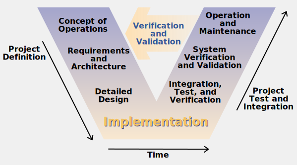

# OnboardPowerManagement
ECSS-like V&amp;V for an onboard power management subsystem simulator with DDS communication.

## Introduction
This project aims to develop a software simulator for an onboard power management subsystem, adhering to ECSS standards for verification and validation (V&amp;V). Documentation is structured to cover all the necessary aspects of system engineering, from requirements to design and analysis, following the V-Model approach.

It is not meant to produce formal deliverables such as System Requirements Specification (SRS), Preliminary Design Reviews (PDR), or other official project milestones. Instead, it provides the necessary groundwork and detailed information that would typically be used to create such deliverables in a real-world project setting.

## Table of Contents
- [1. Project scope](docs/requirements/scope.md)
- [2. Concept of Operations](docs/requirements/conops.md)
- [3. Input Descriptions](docs/analysis/inputs.md)
- [4. Output Descriptions](docs/analysis/outputs.md)
- [5. Functional Requirements](docs/requirements/functional.md)
- [6. Non-Functional Requirements](docs/requirements/non_functional.md)
- [7. Module Definitions](docs/design/modules.md)
- [8. Topic Definitions](docs/design/topics.md)
- [9. Architecture Overview](docs/design/architecture.md)